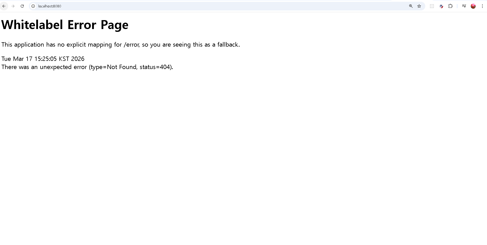

# WIL - 백엔드 정규 스터디 1주차

## 1. 웹과 인터넷

인터넷은 전 세계의 컴퓨터와 기기들이 연결된 거대한 네트워크이며, 웹(Web)은 그 인터넷 위에서 동작하는 서비스 중 하나이다.  
즉 인터넷은 기반 인프라이고 웹은 그 위에서 정보를 공유하는 서비스라고 볼 수 있다.

---

## 2. 웹의 동작 방식

웹은 **클라이언트(Client) - 서버(Server)** 구조로 동작한다.

동작 흐름

1. 클라이언트가 서버에 요청(Request)을 보냄
2. 서버가 요청을 처리
3. 서버가 응답(Response)을 반환
4. 클라이언트가 데이터를 화면에 렌더링

예를 들어 브라우저에서 웹사이트에 접속하면 브라우저가 서버에 페이지 데이터를 요청하고, 서버는 HTML 데이터를 응답으로 보내며 브라우저가 이를 해석하여 화면에 표시한다.

---

## 3. URL

URL은 웹에서 **특정 자원의 위치를 나타내는 주소**이다.

구성 요소

- **Scheme** : 통신 방식 (http, https)
- **Host** : 서버 주소 (example.com)
- **Path** : 서버 내부 자원의 위치
- **Query Parameter** : 추가 정보 전달

---

## 4. HTTP

HTTP는 클라이언트와 서버가 데이터를 주고받을 때 사용하는 **통신 규칙**이다.

특징

- **Stateless**
    - 서버가 이전 요청 상태를 기억하지 않음

- **Connectionless**
    - 요청과 응답이 끝나면 연결 종료

---

## 5. HTTP Method

HTTP Method는 서버 자원에 대해 수행할 행위를 의미한다.

- **GET** : 데이터 조회
- **POST** : 데이터 생성
- **PUT** : 데이터 전체 수정
- **PATCH** : 데이터 일부 수정
- **DELETE** : 데이터 삭제

---

## 6. HTTP 상태 코드

서버가 요청 처리 결과를 나타내는 코드이다.

- **200 OK** : 요청 성공
- **201 Created** : 리소스 생성 성공
- **400 Bad Request** : 잘못된 요청
- **404 Not Found** : 요청한 자원을 찾을 수 없음
- **500 Internal Server Error** : 서버 오류

---

## 7. 프론트엔드와 백엔드

웹 서비스는 크게 두 영역으로 나뉜다.

**프론트엔드**
- 사용자가 보는 화면(UI)
- 브라우저에서 동작

**백엔드**
- 요청 처리
- 데이터 관리
- 비즈니스 로직 수행

---

## 8. 데이터베이스(DB)

데이터를 저장하고 관리하는 시스템이다.

대표적인 데이터베이스

- MySQL
- PostgreSQL
- MongoDB

데이터베이스를 관리하는 프로그램을 **DBMS**라고 한다.

---

## 9. API

API는 프로그램 간 **소통 규칙**이다.  
클라이언트가 어떤 URL로 어떤 HTTP 메서드를 사용하여 요청을 보내고, 서버가 어떤 형식으로 응답을 줄지 정의한 약속이다.

---

## 10. REST API

REST는 HTTP를 효율적으로 활용하기 위한 API 설계 방식이다.

구성 요소

- **Resource (자원)** → URI로 표현  
  예: `/members`

- **Action (행위)** → HTTP Method 사용  
  예: GET, POST, PATCH, DELETE

- **Representation (표현)** → JSON 형식으로 데이터 전달

예시

- POST /members → 회원 생성
- GET /members → 회원 목록 조회
- GET /members/{memberId} → 회원 상세 조회
- PATCH /members/{memberId} → 회원 정보 수정
- DELETE /members/{memberId} → 회원 삭제

---

## 11. Spring과 Spring Boot

**Spring**  
자바 기반 백엔드 애플리케이션 개발을 위한 프레임워크이다.

**Spring Boot**  
스프링을 더 쉽게 사용할 수 있도록 설정을 자동화하고 개발 환경 구성을 간소화한 도구이다.

---

## 12. 정리 및 느낀 점

이번 강의를 통해 웹 서비스의 기본 구조를 이해할 수 있었다.  
웹은 **클라이언트의 요청 → 서버 처리 → 응답** 구조로 동작하며, 이 과정에서 HTTP와 API가 중요한 역할을 한다.

또한 REST API를 통해 서버 기능을 체계적으로 설계할 수 있다는 점을 알게 되었고, 앞으로 스프링 부트를 활용해 이러한 구조를 실제로 구현해 보는 과정이 중요할 것이라고 생각한다.

---

## 13. Spring Boot 실행 결과

Spring Boot 실행 후 localhost:8080 접속 시 다음과 같은 화면이 나타났다.

---

## 14. API 명세서 (상품 / 주문)

---
## 회원 기능 API 명세서 예시

### 1. 회원 등록
- HTTP Method : POST
- URI : /members

### 2. 회원 목록 조회
- HTTP Method : GET
- URI : /members

### 3. 개별 회원 정보 상세 조회
- HTTP Method : GET
- URI : /members/{memberId}

### 4. 회원 정보 수정
- HTTP Method : PATCH
- URI : /members/{memberId}

### 5. 회원 삭제
- HTTP Method : DELETE
- URI : /members/{memberId}

---

### 상품 기능

#### 1. 상품 등록
- HTTP Method : POST
- URI : /products

#### 2. 상품 목록 조회
- HTTP Method : GET
- URI : /products

#### 3. 상품 상세 조회
- HTTP Method : GET
- URI : /products/{productId}

#### 4. 상품 정보 수정
- HTTP Method : PATCH   
- URI : /product/{productId}

#### 5. 상품 삭제
- HTTP Method : DELETE
- URI : /product/{productId}

---

### 주문 기능

#### 1. 주문 생성
- HTTP Method : POST
- URI :/orders

#### 2. 주문 목록 조회
- HTTP Method : GET 
- URI : /orders

#### 3. 주문 상세 조회
- HTTP Method : GET
- URI : /orders/{ordersId}

#### 4. 주문 취소
- HTTP Method :DELETE
- URI : /orders/{ordersId}
