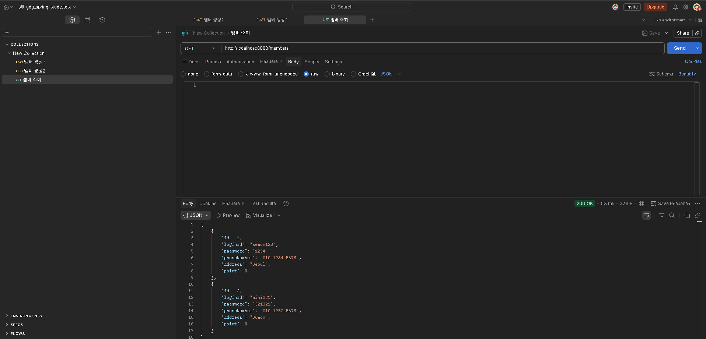
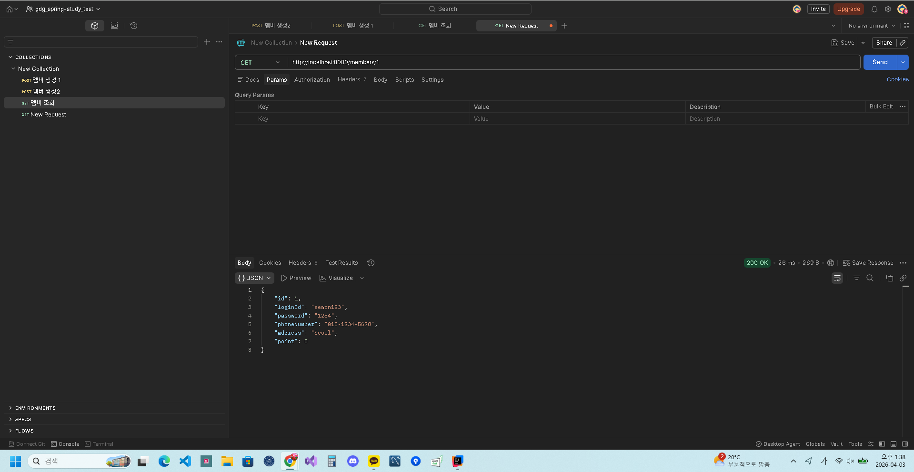
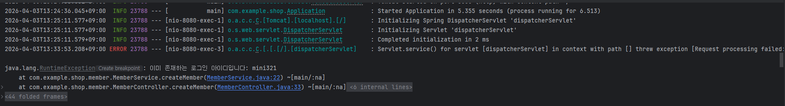

# 📌 Week 2 WIL (계층형 아키텍처 & Controller/Service)

## 1. 스프링 계층형 아키텍처 이해

스프링은 **계층형 아키텍처(Layered Architecture)**를 기반으로 구성된다.
각 계층은 역할이 명확하게 분리되어 있으며, 다음과 같은 흐름으로 동작한다.

```
Client → Controller → Service → Repository → DB
```

이를 레스토랑에 비유하면 다음과 같다:

* Controller → 웨이터 (요청 전달)
* Service → 요리사 (비즈니스 로직 처리)
* Repository → 창고 관리자 (데이터 접근)
* DB → 재료 저장소

즉,
Controller는 요청을 받고,
Service는 실제 로직을 처리하며,
Repository는 데이터를 관리한다.

---

## 2. Controller 계층

Controller는 HTTP 요청을 가장 먼저 받는 계층이다.

### 주요 역할

* HTTP 요청/응답 처리
* URL 매핑
* DTO를 통해 데이터 전달

### 주요 어노테이션

```java
//@RestController
//@RequestMapping("/members")
```

* `@RestController` : Controller + ResponseBody
* `@RequestMapping` : 공통 URL 설정

---

### HTTP 메서드별 역할

| 메서드    | 역할 |
| ------ | -- |
| GET    | 조회 |
| POST   | 생성 |
| PATCH  | 수정 |
| DELETE | 삭제 |

---

### 상태 코드

| 코드                        | 의미     |
| ------------------------- | ------ |
| 200 OK                    | 성공     |
| 201 Created               | 생성 성공  |
| 204 No Content            | 삭제 성공  |
| 400 Bad Request           | 잘못된 요청 |
| 500 Internal Server Error | 서버 오류  |

---

### ResponseEntity 사용 이유

```java
//return ResponseEntity.ok(data);
```

* HTTP 응답을 직접 제어 가능
* 상태 코드 + 헤더 + 바디 설정 가능

---

## 3. DTO (Data Transfer Object)

DTO는 계층 간 데이터 전달을 위한 객체이다.

* 필요한 데이터만 포함
* Entity 직접 노출 방지

예:

```java
public class MemberCreateRequest {
    private String loginId;
    private String password;
    private String phoneNumber;
    private String address;
}
```

---

## 4. Service 계층

Service는 **비즈니스 로직을 담당하는 핵심 계층**이다.

### 역할

* 실제 로직 처리
* 데이터 검증
* Repository와 통신

---

### 예시: 회원 생성 로직

```java
public Long createMember(MemberCreateRequest request) {

    Member existingMember = memberRepository.findByLoginId(request.getLoginId());

    if (existingMember != null) {
        throw new RuntimeException("이미 존재하는 로그인 아이디입니다.");
    }

    Member member = new Member(
        request.getLoginId(),
        request.getPassword(),
        request.getPhoneNumber(),
        request.getAddress()
    );

    memberRepository.save(member);

    return member.getId();
}
```

👉 단순 저장이 아니라

* 중복 체크
* 예외 처리
* 객체 생성
  이 모두 포함된다.

---

## 5. 트랜잭션 개념

Service 계층에서는 **트랜잭션**을 사용한다.

* 여러 작업을 하나의 단위로 처리
* 전부 성공하거나 전부 실패해야 함

예:

* 주문 중 일부 실패 시 전체 롤백

```java
//@Transactional
```

※ 이번 주차에서는 DB를 사용하지 않아 적용하지 않음

---

## 6. 스프링 빈과 의존성 주입 (DI)

스프링은 객체를 직접 생성하지 않고
**스프링 컨테이너가 관리하는 객체(Bean)** 를 사용한다.

---

### Bean 등록

```java
/*
@Service
@RestController
@Repository
*/
```

→ 자동으로 스프링 빈으로 등록됨

---

### 의존성 주입 (DI)

```java
/*
@RequiredArgsConstructor
private final MemberService memberService;
*/
```

* 객체를 직접 생성하지 않음
* 스프링이 대신 주입

👉 장점:

* 코드 결합도 감소
* 재사용성 증가
* 테스트 용이

---

## 7. 패키지 구조

이번 프로젝트는 **도메인형 구조** 사용

```
member/
 ├── MemberController
 ├── MemberService
 ├── MemberRepository
 ├── Member
 └── dto
```

### 장점

* 관련 코드 한 곳에 모임
* 유지보수 쉬움

---

## 8. Order 도메인의 특징

Order는 Member/Product와 다르게
**단순 CRUD 대상이 아니라 “거래 기록”이다.**

### 특징

* 삭제 ❌ → 취소(cancel) 사용
* 상태 기반 관리 (CREATED, CANCELLED)

### API 설계 예

```
POST /orders
GET /orders
GET /orders/{id}
PATCH /orders/{id}/cancel
```

👉 핵심은 “수정”이 아니라 “상태 변경”

---

## 9. 이번 과제 구현 내용

### Member

* 회원 생성
* 회원 조회
* 회원 수정
* 회원 삭제

### Product

* 상품 등록
* 상품 조회
* 상품 수정
* 상품 삭제

### Order

* 주문 생성
* 주문 조회
* 주문 상세 조회
* 주문 취소

---

## 10. 느낀 점

이번 주차를 통해
스프링의 구조가 단순한 CRUD가 아니라
**역할 분리 기반 설계**라는 것을 이해하게 되었다.

특히:

* Controller는 단순 전달 역할
* Service는 비즈니스 로직 중심
* Order는 CRUD가 아닌 상태 중심 설계

이 부분이 인상 깊었다.

또한 아직 Repository와 Entity를 구현하지 않았지만
전체 흐름을 먼저 잡는 방식이 이해에 도움이 되었다.

---

##  Postman을 통한 Member 도메인 API 테스트

## 📌 실행 결과 및 테스트

### 1️⃣ [POST -> GET]



**설명:**

* POST 로 멤버 2개 생성 후에 GET 으로 모든 멤버를 조회한 POSTMAN 화면이다.


---

### 2️⃣ [GET 으로 단일 멤버 조회]



**설명:**

* members/{memberId} 로 첫번째 저장된 멤버 아이디의 정보를 조회해 보았다.


---

### 3️⃣ [스프링 부트 터미널 부분]




**설명:**

* 스프링부트 터미널에서도 실제 데이터의 변화가 감지되었다. 


